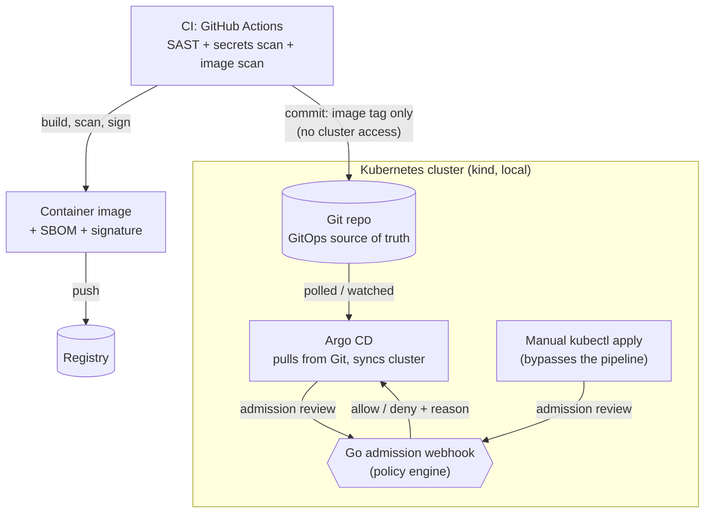

# Guardrail

[](https://github.com/Davidpotters/guardrail/actions/workflows/webhook-ci.yml)

A self-hosted policy-enforcement platform for Kubernetes: CI builds, scans,
and signs a container image, GitOps (Argo CD) deploys it, and a
hand-written Go admission webhook enforces security policy inside the
cluster itself -- before anything unsafe can run, not after.

**Status: v0 through v4 done and verified live, not just written.** See
the roadmap below for exactly what "verified" means for each one.

## Why this exists

Most CI/CD security stops at "scan the image and hope someone reads the
report." Guardrail enforces policy at the one point it can't be
bypassed: the Kubernetes API server itself. Even a deployment pushed by
hand with `kubectl apply`, bypassing the pipeline entirely, still has to
pass the admission webhook -- because the webhook is a property of the
cluster, not of the pipeline that happened to be used this time.

The pipeline (GitHub Actions, standing in for Harness -- see the v3 roadmap
entry) and the deploy mechanism (Argo CD) are kept
strictly separate on purpose: CI never holds cluster credentials. It only
ever updates a Git repository; Argo CD, running inside the cluster,
pulls from that repository itself. If CI is ever compromised, the
attacker still can't touch the cluster directly.

## Design philosophy

A few pieces here are deliberate choices, not the easiest path available:

- **Hand-rolled Go webhook, not Gatekeeper.** OPA/Gatekeeper is the
  standard way to wire admission control into Kubernetes today -- policy
  as Rego, applied with `kubectl apply`, no custom server to run or
  maintain, and the right call for most production teams. Guardrail
  writes the webhook by hand instead, on purpose: it's a stronger
  demonstration of direct competency against the Kubernetes
  `admission/v1` API and Go itself than configuring an existing policy
  engine would be.
- **A Dockerfile written from scratch.** Consuming pre-built images is
  common enough in platform work that authoring one is easy to skip
  entirely. The webhook's own container image is a real multi-stage Go
  build, written and maintained here.
- **SBOM generation and image signing.** Real supply-chain security
  steps that are easy to leave for later indefinitely. Guardrail's
  pipeline generates a real SBOM and signs the resulting image, not
  because a solo project strictly needs it, but because doing it once,
  correctly, is worth more than reading about it.

## Architecture



Every resource creation or update -- whether it came from Argo CD or a
manual `kubectl apply` -- passes through the webhook. There's no path
that skips it.

## Roadmap

- [x] **v0 — Toolchain verified.** Docker (via colima), `kind`, `kubectl`,
      the Argo CD CLI, and Go all installed and confirmed working
      locally.
- [x] **v1 — Cluster + GitOps loop.** A `kind` cluster running a trivial
      demo app, deployed via Argo CD pulling from this repo's own
      manifests over a read-only SSH deploy key (the repo stays
      private). Verified three separate ways, not just "it synced
      once": the initial sync adopted resources that already existed
      in the cluster without duplicating them; a live commit (bumping
      replicas) propagated automatically with no `kubectl apply` from
      me; and manually scaling the deployment by hand was reverted by
      Argo CD's self-heal in about a second, directly observed with
      timestamped polling, not inferred from a gap between two checks.
- [x] **v2 — Go admission webhook.** A `ValidatingAdmissionWebhook`
      written in Go (`webhook/`), registered with the cluster, enforcing
      the real policy set: required resource limits, no root containers,
      no `:latest` image tags, images only from an allow-listed
      registry. Packaged with a hand-written multi-stage Dockerfile, something this
      project required writing from scratch rather than building on a
      pre-built base image. Verified live: a noncompliant
      pod applied directly with `kubectl apply` (no pipeline involved
      at all) is rejected by the API server itself, with every
      violation listed in one response. `webhook/deploy.sh` builds,
      loads into `kind`, and registers the whole thing end to end.
- [x] **v3 — CI pipeline.** Built on GitHub Actions
      (`.github/workflows/webhook-ci.yml`), not Harness -- Harness needs
      an account signup that isn't worth blocking a portfolio demo on,
      and the pipeline logic is what actually matters here, not which
      vendor runs it. SAST (CodeQL) and secrets scanning (gitleaks)
      gate the build; Trivy fails it on Critical/High image
      vulnerabilities; an SBOM gets generated and the image is signed with cosign,
      keylessly via GitHub's own OIDC identity -- no signing key ever
      generated, stored, or capable of leaking. The pipeline's only
      write access to anything is a commit back to this repo's own
      manifest with the new image tag -- it never touches the cluster.
      Independently verified, not just trusted from a green checkmark:
      pulled the real published image and ran `cosign verify` against
      it from a separate machine, confirming the signature checks out
      against Sigstore's transparency log and is tied to this exact
      repo's GitHub Actions identity.
- [x] **v4 — Failure-mode demo.** Three scenarios, each actually
      reproduced against the running cluster, not just described:
      a direct `kubectl apply` bypass rejected outright; a noncompliant
      change pushed through the trusted GitOps path, where the
      Deployment update itself succeeds but every pod the resulting
      ReplicaSet tries to create gets rejected, leaving the rollout
      stuck while the old compliant pods keep running untouched; and
      the webhook itself going down, which -- by design
      (`failurePolicy: Fail`) -- blocks *all* pod creation cluster-wide,
      not just noncompliant ones, verified by scaling it to zero and
      watching even a fully compliant pod get refused.

## Tech stack

- **CI:** [GitHub Actions](https://github.com/features/actions) -- standing
  in for [Harness](https://harness.io) (see the v3 roadmap entry for why)
- **Supply chain:** [Trivy](https://trivy.dev) (image scanning),
  [Syft](https://github.com/anchore/syft) (SBOM), [cosign](https://www.sigstore.dev/)
  (keyless image signing)
- **GitOps / CD:** [Argo CD](https://argo-cd.readthedocs.io)
- **Policy enforcement:** Go, using `k8s.io/api` and the Kubernetes
  `admission/v1` API
- **Cluster:** [kind](https://kind.sigs.k8s.io) (Kubernetes-in-Docker,
  local, free)
- **Container runtime:** Docker via [colima](https://github.com/abiosoft/colima)

## Setup

```bash
# Toolchain
brew install kind kubernetes-cli argocd go colima lima docker
colima start

# 1. The cluster + Argo CD
kind create cluster --name guardrail
kubectl create namespace argocd
kubectl apply -n argocd -f https://raw.githubusercontent.com/argoproj/argo-cd/stable/manifests/install.yaml --server-side --force-conflicts

# 2. Repo access for Argo CD -- the repo stays private, so this needs a
#    credential scoped to exactly this one repo, read-only, rather than
#    a broader personal token
ssh-keygen -t ed25519 -f ~/.ssh/guardrail_argocd_deploy -N ""
# add ~/.ssh/guardrail_argocd_deploy.pub as a read-only deploy key on the repo
kubectl create secret generic guardrail-repo -n argocd \
  --from-literal=type=git \
  --from-literal=url=git@github.com:Davidpotters/guardrail.git \
  --from-file=sshPrivateKey=$HOME/.ssh/guardrail_argocd_deploy
kubectl label secret guardrail-repo -n argocd argocd.argoproj.io/secret-type=repository
kubectl apply -f argocd/appproject.yaml
kubectl apply -f argocd/application.yaml

# 3. The admission webhook -- builds, loads into kind, and registers itself
./webhook/deploy.sh
```

Everything after that is driven by git: pushing a manifest change under
`manifests/` reaches the cluster through Argo CD, and pushing a change
under `webhook/` triggers `.github/workflows/webhook-ci.yml`, which builds,
scans, signs, and updates the manifest for Argo CD to pick up in turn.

## License

[MIT](LICENSE)
